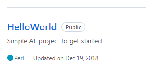
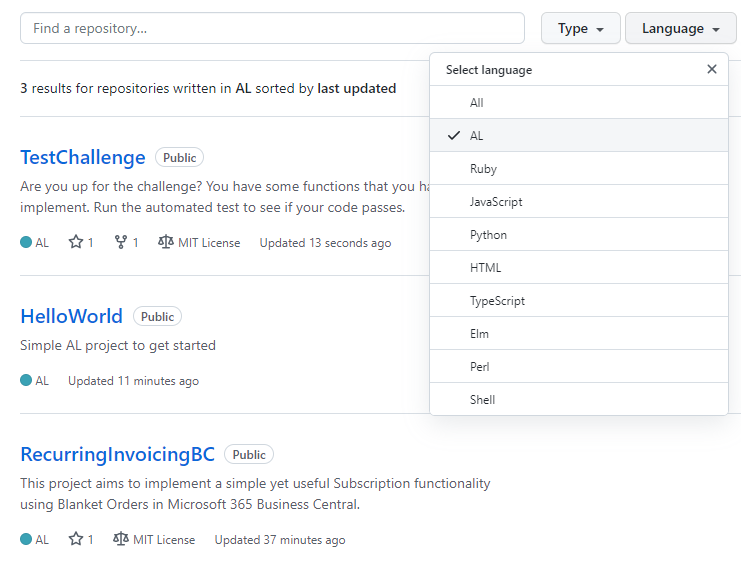

# GitAttributes in AL projects
 
Help GitHub detect that your project is written in the Microsoft Dynamics 365 Business Central AL language.

## Explanation
The [AL Language](https://github.com/microsoft/AL) is used for developing and customizing the Microsoft Dynamics 365 Business Central solution.

It took a while before the AL language was recognized by GitHub and at first it was called AL Code, 
before it was [renamed](https://github.com/github/linguist/pull/5023/files) to AL.


This means that your older projects might be detected as written in Perl.




## Adding a .gitattributes file to your project
The solution is to add a new file in the root of your old AL projcts.

Name the file `.gitattributes` and insert the following line and save it.

````
*.al linguist-language=AL
````

You can add the file directly on GitHub by chosing Add file, Create new file.
The project is then correctly detected as being a AL project and  you can filter your GitHub repositories by the AL language.



## Example
https://github.com/finnpedersenkazes/HelloWorld 


## GitHub Documentation
https://github.com/github/linguist/blob/master/docs/overrides.md

